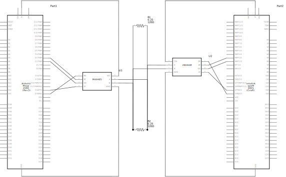

# MAX485TTL library
This library provides an easy way to use the RS485 modules MAX485TTL. These modules are half-duplex so data can only be received or send at one time. 

This library helps user to easyly set the modules to output and back to input. 

| Name | Function                                                   |
| ---- | ---------------------------------------------------------- |
| RO   | Receiver output (RX)                                       |
| RE   | Receiver output enable                                     |
| DE   | Driver output enable                                       |
| DI   | Driver input (TX)                                          |
| A    | Noninverting reciever input and noninverting driver output |
| B    | Inverting receiver input and inverting driver output       |
| Vcc  | Positive supply: 4.75V - 5.25V                             |
| GND  | Ground                                                     |

Tying RE and DE together to 1 output can also be done, these will always be the same value. This will save 1 IO port.

## Best practices
The modules work best when always set to input unless data needs to be sent.

Arduino input buffer consists of only 64 chars so messages longer then this need to be handeld mid receiving, the library has a method for this, ReadIntoBuffer(). This will put all received data into the buffer of pre defined length (default 64).

Be aware when using RS485 the communication rails need to be terminated by a resistor. When receiving a lot of distortion this is caused by a not correct set up termination resistor. The resistor is ussually 120 ohms.

If all chars are unknown probably A and B are switched. Make sure A is connected to A and B is connected to B.

Written using [Google c++ style guide](https://google.github.io/styleguide/cppguide.html)